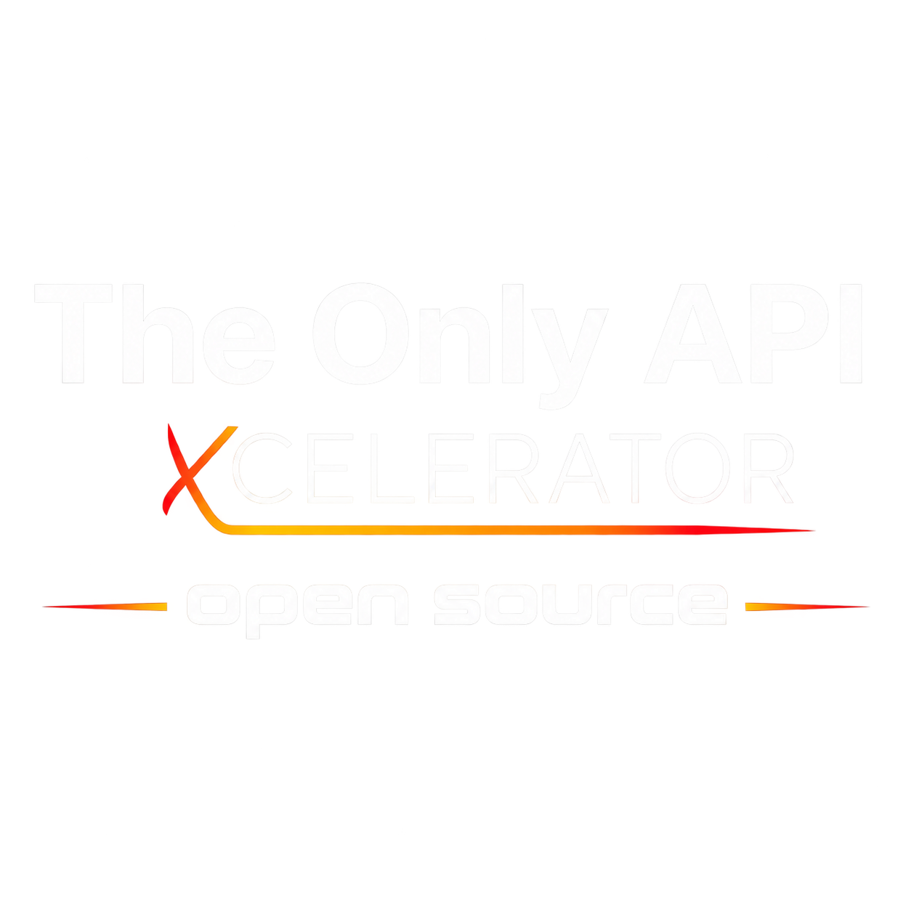
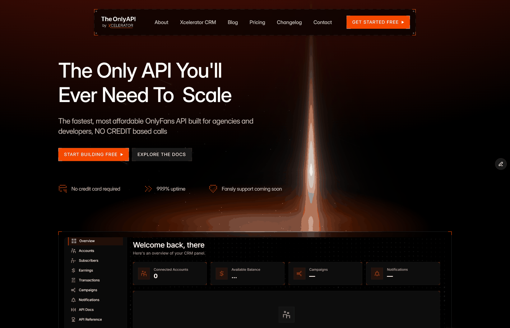

<div align="center">



<h1>OnlyFans API Open Source</h1>

<h3>Self-hosted CRM, REST API and MCP server for OnlyFans and Fansly</h3>

<p>
Your server, your database, your keys.<br>
AGPL-3.0. No telemetry, no licence check, no account limits.
</p>

<p>
  <strong>Need managed hosting, automatic updates and support?</strong><br>
  <a href="https://theonlyapi.com/pricing">Use the hosted version from The Only API →</a>
</p>

[](LICENSE)
[](LICENSE)
[](Dockerfile)
[](Dockerfile)
[](docker-compose.yml)



</div>

---

## Run it

```bash
git clone https://github.com/XceleratorCRM/onlyfans-api-open-source.git
cd onlyfans-api-open-source
cp .env.example .env
```

Put four generated secrets in `.env`:

```bash
python3 -c "import secrets; print('SECRET_KEY=' + secrets.token_urlsafe(32))"
python3 -c "import secrets; print('ENCRYPTION_KEY=' + secrets.token_urlsafe(32))"
python3 -c "import secrets; print('NEXTAUTH_SECRET=' + secrets.token_urlsafe(32))"
python3 -c "import secrets; print('INTER_SERVICE_TOKEN=' + secrets.token_urlsafe(32))"
```

```bash
docker compose up -d --build
```

Panel on <http://localhost:3000>, API on <http://localhost:5000>, and MCP on
<http://localhost:8181/mcp>. Opening the panel starts at owner-account
registration — email and password, no confirmation email — and you are in.

> **Back up `ENCRYPTION_KEY` off this machine now.** It encrypts every stored
> creator password and session. There is no reset and no recovery.

**Using an AI agent?** Point it at [AGENT-LAUNCH.md](AGENT-LAUNCH.md) for the
operator interview, exact launch sequence, account connection and handover.

## Then: two things only you can supply

**A captcha key.** OnlyFans puts a Cloudflare challenge in front of every login
and it must be solved by a paid service. Get one at
[2captcha.com](https://2captcha.com), add a few dollars, and paste it into
**Settings → Captcha provider**. The panel verifies it before saving. You do not
need this to start the stack or look around — only to connect an account.

**One proxy per OnlyFans creator account**, residential or mobile. Each
OnlyFans account should keep its own egress IP; a datacentre IP, or one shared
across several accounts, is the fastest way to get them all flagged. Fansly can
connect without a proxy, although a stable proxy may still be used. Price the
OnlyFans proxies first — at ten accounts they will exceed every other cost
combined.

Then **Accounts → Add account**, paste session cookies (or email and password)
plus the proxy, turn polling on, and it starts pulling fans, messages,
subscribers and earnings on its own.

## What's in it

- **REST API** — messaging, mass DMs, posts, the vault, fans, subscribers,
  earnings, payouts, campaigns and exports, across both platforms
- **Dashboard** — accounts, fans, inbox, subscribers, earnings, transactions,
  campaigns, automations, webhooks, settings
- **Event engine** — per-account polling that turns notification, balance and
  subscriber deltas into typed events, with jobs that survive a restart
- **Webhooks** — HMAC-SHA256 signed, `[5s, 30s, 5m, 30m, 2h]` retries,
  auto-deactivation of dead endpoints
- **Automations** — trigger, conditions, templated action, with Discord, Slack,
  Telegram and DM connectors
- **MCP server** — drive the whole thing from Claude, ChatGPT or Cursor
- **Live streams and exports** — SSE for real-time updates; CSV/JSON exports

## Where it runs

A plain VPS (recommended), or any host that runs Docker with a persistent disk —
Coolify, Dokploy, Render, Fly.io, Railway.

**It cannot run on Vercel, Netlify, Cloudflare Workers, Lambda or Heroku.** It
needs one always-on process, a persistent disk, Python and Node in the same
container, long-lived HTTP for SSE, and 300-second request tolerance for a
login. [Why, in detail](SELF-HOSTING.md#will-not-work--and-why).

**Run exactly one API process.** Not one per CPU — one. The scheduler, the event
hub and the rate limiter all hold state in-process, so a second process double-
polls, double-spends your captcha balance and splits the event stream.
`gunicorn.conf.py` enforces this and refuses to start otherwise.

## Docs

| | |
|---|---|
| [AGENT-LAUNCH.md](AGENT-LAUNCH.md) | End-to-end launch instructions for an AI agent |
| [PRODUCTION-ACCEPTANCE.md](PRODUCTION-ACCEPTANCE.md) | Two-run production release and live-account test gate |
| [AGENTS.md](AGENTS.md) | Short in-repository operating instructions for coding agents |
| [SELF-HOSTING.md](SELF-HOSTING.md) | Deployment, TLS, backups, upgrades, troubleshooting |
| [docs/ARCHITECTURE.md](docs/ARCHITECTURE.md) | How it fits together |
| [docs/EVENTS.md](docs/EVENTS.md) | Event taxonomy and webhook payloads |
| [docs/](docs/) | Earnings model, export API, hardening |

The full API reference is in the panel at `/dashboard/api-docs`, and the OpenAPI
spec is served at `/api/openapi.json`.

## Contributing

Issue reports and feature proposals are welcome. Pull requests are restricted to
project collaborators so unsolicited code cannot be submitted directly. Start with
an issue; maintainers can invite a contributor when a change has been agreed. All
accepted commits use the [DCO](https://developercertificate.org/)
(`git commit -s`) — no CLA and no copyright assignment. See
[CONTRIBUTING.md](CONTRIBUTING.md), and never paste creator or fan identifiers into
an issue.

**If a platform change breaks something, tell us** — that is the most valuable
report this project can receive, and there is a template for it.

## Licence

[AGPL-3.0](LICENSE). Use it for yourself, your agency or your clients,
commercially, freely. Modify it however you like. The only obligation triggers
if you offer **modified** software to other people over a network as a service:
then those users must be offered your modified source under the same licence.

The OnlyFans request-signing layer descends from
[Onlyfans Headers Reverse Engineered](https://t.me/Pr0t0npro) by **Pr0t0npro**,
published under GPL-3.0 — which is why this is copyleft rather than MIT. See
[NOTICE](NOTICE).

## Trademarks and disclaimer

**OnlyFans** is a trademark of Fenix International Limited. **Fansly** is a
trademark of its respective owner. This project is an independent work and is
**not affiliated with, endorsed by, sponsored by, or connected to** either. Those
names are used only to describe the platforms this software talks to.

You are responsible for your own use of this software, including compliance with
each platform's terms and the law where you and your creators are. Connect only
accounts you own or are authorised to manage. Provided **as-is, without warranty**
— see sections 15 and 16 of [LICENSE](LICENSE).
